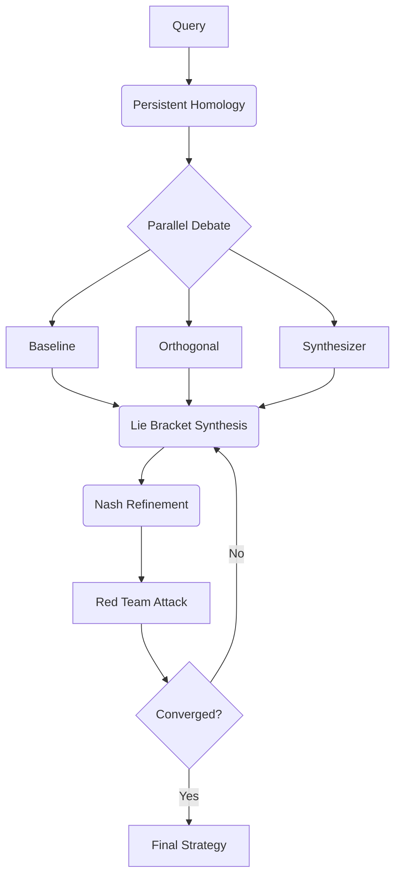

# SAGE Architecture

SAGE (Strategic Adversarial Generative Engine) is a 6-layer reasoning stack designed for high-stakes strategic synthesis.

## The 6 Layers

1.  **Layer 1: Neural Embedding (BGE-Large)** - Converts queries and corpus into high-dimensional vectors.
2.  **Layer 2: Topological Routing (FAISS + Gudhi)** - Identifies regions of "maximal ignorance" (topological voids) in the knowledge base to ensure diverse perspective gathering.
3.  **Layer 3: Torsion Warping (Riemann-Cartan)** - Shifts agent contexts along orthogonal axes to prevent groupthink.
4.  **Layer 4: Parallel Debate (Non-Abelian)** - Agents generate responses simultaneously. The synthesis is non-commutative: the order of integration matters.
5.  **Layer 5: Nash Refinement (Minimax)** - A red-team agent attacks the proposal until a damage threshold (Nash equilibrium) is reached.
6.  **Layer 6: Verification (SAGE-XAI)** - Proof-of-Work timestamping and transparency logging.

## Core Reasoning Loop: AODE

AODE (Adversarial Orthogonal Divergence Engine) implements the mathematical operators that drive SAGE.

