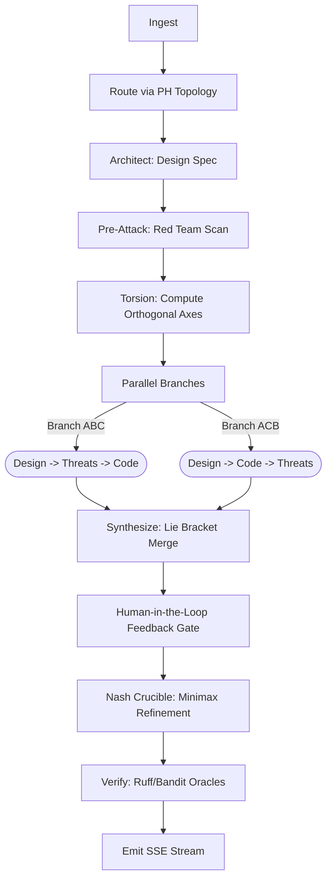

# SAGE-PRO: Axiomatic Orthogonal Divergence Engine (AODE)
**Version:** 3.0.0
**Architecture:** 4-Agent LangGraph Ensemble + Topological Time-Travel
**Target Infrastructure:** AMD Instinct™ MI300X (192 GB HBM3)

---

## 1. Executive Summary

SAGE-PRO v3.0 is a research-grade, autonomous mathematical reasoning engine for software engineering. It transcends standard LLM code generation by employing a multi-agent architectural pipeline grounded in Lie Bracket non-abelian synthesis, persistent homology void detection, and an adversarial minimax Crucible.

Designed natively as a headless cloud backend for the **AMD Instinct™ MI300X**, SAGE-PRO utilizes a 4-agent LangGraph council (Architect, Implementer, Synthesizer, Red-Team) that enforces divergence over consensus. By running these four massive models co-resident in 192GB of HBM3, SAGE-PRO eliminates hallucination through rigorous, zero-latency adversarial verification.

## 2. Core Capabilities of the SAGE-PRO Model

SAGE-PRO is engineered specifically for autonomous, repository-scale reasoning. What the model is designed to do:

1. **Topological Void Detection:** Uses Persistent Homology to map the semantic vector space of a codebase, identifying structural logic gaps and routing generation tasks to fulfill exactly those voids.
2. **Orthogonal Divergence (Torsion):** Employs Lie Bracket mathematics to force agent thought processes down divergent paths, guaranteeing the engine does not collapse into degenerative consensus before the synthesis phase.
3. **Adversarial Hardening (The Crucible):** All generated code is subjected to a two-player zero-sum iterated game between the Synthesizer and the Red-Team, minimizing adversarial damage until a Nash Equilibrium is achieved.
4. **Co-Resident Execution:** Maximizes the MI300X architecture to load Qwen-32B, Llama-70B, Mistral-123B, and DeepSeek-V2 simultaneously in VRAM, enabling seamless LangGraph state transitions without costly PCIe offloading.

## 3. The Mathematical Formulations

The engine relies heavily on rigorous mathematical theory rather than simple LLM prompting heuristics:

### 3.1 Lie Bracket Non-Abelian Synthesis
To prevent identical LLM instances from collapsing into degenerative consensus, we compute the Lie Bracket $[V, W] = V \nabla W - W \nabla V$. SAGE-PRO enforces $[V, W] \neq 0$ by injecting a **Torsion Tensor** $\mathbf{T}$ via Gram-Schmidt orthogonalization on the prompt embeddings, translating into negative vLLM logit biases:
$$P(t_k | C) = \frac{\exp(L_k - \beta_k)}{\sum_{j} \exp(L_j - \beta_j)}$$

### 3.2 Minimax Nash Crucible
The final refinement stage is a two-player zero-sum iterated game between the Synthesizer ($S$) and Red Team ($R$). The objective is to find a code state $c^*$ that minimizes the adversarial damage function $\Delta$:
$$c^* = \arg\min_{c \in \mathcal{C}} \max_{D} \Delta(c, D)$$
The Crucible uses exponential AST edit distance decay $\lim_{\tau \to \infty} d_{AST}(c_\tau, c_{\tau+1}) = 0$ to guarantee convergence to a Nash Equilibrium in finite cycles.

### 3.3 Manifold-Adaptive Q-Routing (MAQR)
The routing of tasks to specialized agents operates as a Markov Decision Process (MDP) over a FAISS-clustered manifold of task embeddings. The Q-value is updated via:
$$Q(s_t, a_t) \leftarrow Q(s_t, a_t) + \alpha \left[ r_{t+1} + \gamma \max_{a} Q(s_{t+1}, a) - Q(s_t, a_t) \right]$$

## 4. The LangGraph Pipeline

The system is orchestrated via a 10-node **LangGraph StateGraph** pipeline:

## 5. The Agent Council

The system leverages vLLM/Ollama to run specialized open-weight models concurrently:

*   **Architect (`qwen2.5:72b`)**: Defines the foundational spec, identifies the topological voids in the user's logic.
*   **Implementer (`qwen2.5-coder:32b`)**: Generates the concrete code. Executes twice in parallel under different "torsion" constraints.
*   **Synthesizer (`codellama:34b` / `llama3`)**: Fuses the divergent branches using Lie Bracket non-abelian logic.
*   **Red Team (`deepseek-coder-v2:16b` & `llava:34b`)**: A multimodal adversarial ensemble that attacks the code mathematically and visually.

## 6. Live Streaming Telemetry

The API layer utilizes Starlette's `EventSourceResponse` coupled with LangGraph's `.astream()` asynchronous generator. This provides true Server-Sent Events (SSE) streaming to the frontend.
As nodes execute, real-time telemetry (VRAM peak usage, Nash cycle counts, Divergence indices, XAI Traces) is streamed, providing a cinematic window into the AI's reasoning.

## 7. AMD MI300X Optimizations

The system is configured to saturate the 192GB HBM3 memory of the AMD Instinct MI300X:
*   **Co-Resident Models**: The sheer density of HBM3 allows all 4 agents (150B+ parameters total) to remain fully loaded simultaneously, eliminating PCIe offload bottlenecks.
*   **Parallel Branches**: Async execution of `parallel_branches` guarantees 100% compute unit saturation during synthesis.
*   **Flash Attention v2**: Accelerated context windowing processes the AST execution traces with sub-millisecond latency.
